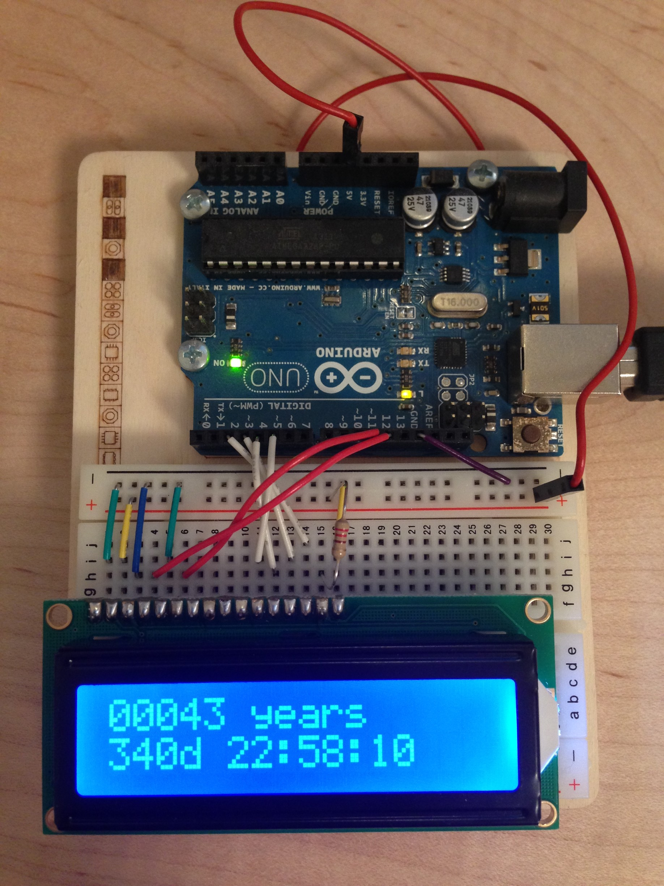

# Arduino Death Clock

Countdown the years/days/seconds remaining in your life.

## What is this?

A death clock. Based on a average life expectancy, you can use this
clock to countdown the time until your expected last day of life.

I use it as a regular reminder that my life has a limit; a
best-before-date. This knowledge helps me make better decisions about
how to spend my time and how I want to live with the time I have.

## What's my life expectancy?

We can't know the future, so we can't accurately predict how long
you'll live. The next best option is to use research & statistics to
generate a probably life expectancy.

Here are a couple of life expectancy calculators that (I think) have
some science behind them:

+ [Abaris - How long will I live?](https://www.myabaris.com/tools/life-expectancy-calculator-how-long-will-i-live/)
  + I like that it considers health & lifestyle factors
+ [US Social Security Administration: Life Expectancy Calculator](https://www.ssa.gov/planners/lifeexpectancy.html)
  + I like that it gives estimates based on future ages. [The Lindy Effect is real](https://en.wikipedia.org/wiki/Lindy_effect) (up to the biological limits of the human body).

## What do I need to build it?

+ Arduino board (I used the Uno)
+ 16x2 LC display (LCD), though you can use (almost) any LCD component that you can connect to a breadboard.
+ breadboard & contact wires
+ [Arduino dev environment](https://www.arduino.cc/en/Main/Software)

If you don't already have an Arduino or display, I would recommend
[Adafruit](https://www.adafruit.com/).

### How to build the circuit

Fortunately, someone has already put together a great set of tutorials
on setting up the LCD.
[This "Hello World!" tutorial](https://www.arduino.cc/en/Tutorial/HelloWorld)
will show you how to complete the circuit and run a test (if you
like).

## What are some modifications I could do?

#### Change the number formatting 

This is easy to do just by looking at the code. You might want to
reduce the number of zeros in the years display, for example.

#### External power source

I'm sure you're thinking that it would be great to not have to keep
the Arduino plugged into the wall all the time. You can get an
external power source (like one from
[Adafruit](https://www.adafruit.com/)) to make that easy.

##### IMPORTANT

Since the Arduino board (a basic one) has no built in clock, it also
can't find the current time by itself. So, if you unplug your Arduino
Death Clock then the countdown will return the same as the last time
you plugged it in.

To resolve this issue, read on.

#### Add a clock source

There are components you can buy to act as a clock source (like an
RTC), otherwise you can add an ethernet or wifi connector and use NTP
over the internet. The
[Arduino Time Library](https://github.com/PaulStoffregen/Time) that
this project uses has some code examples that you can pull from. 

If you do implement this, PRs are welcome.
